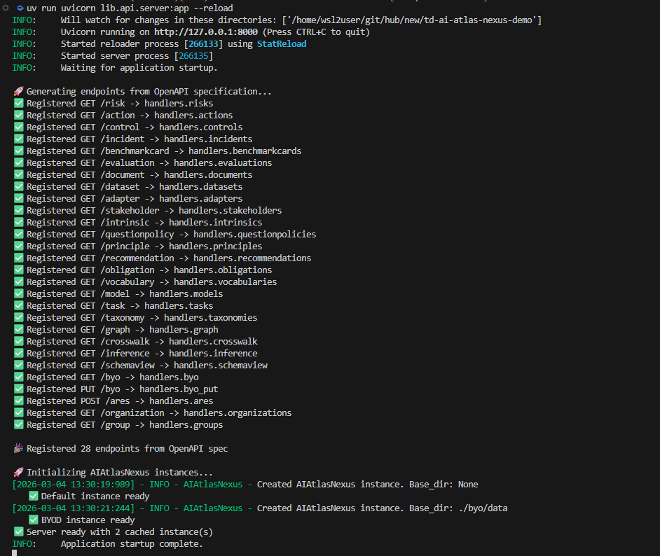
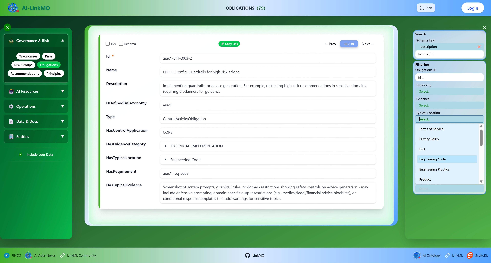
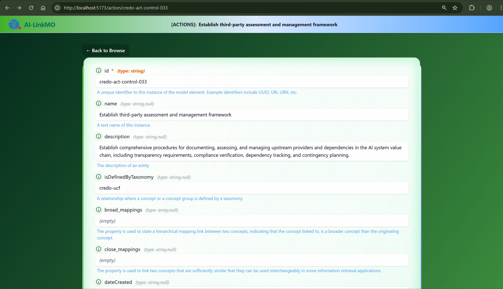
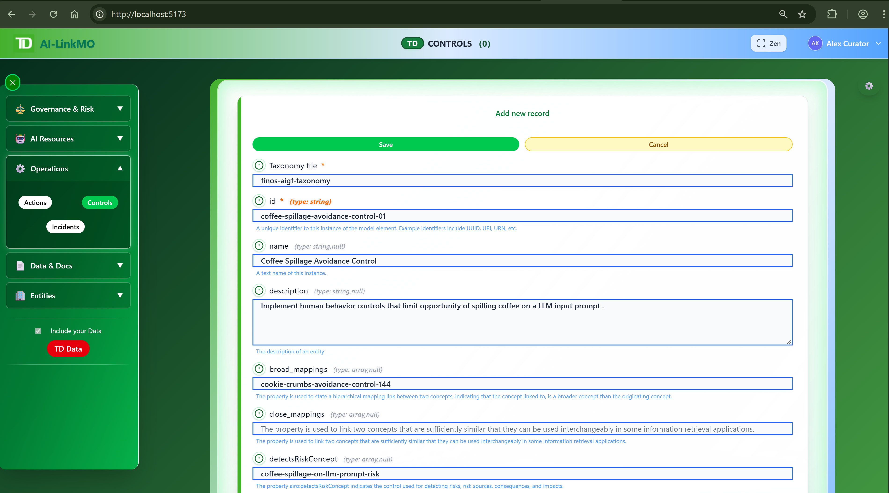
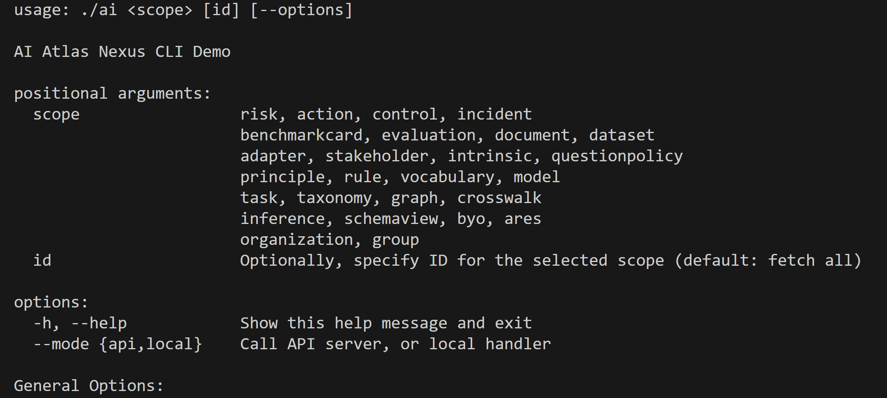
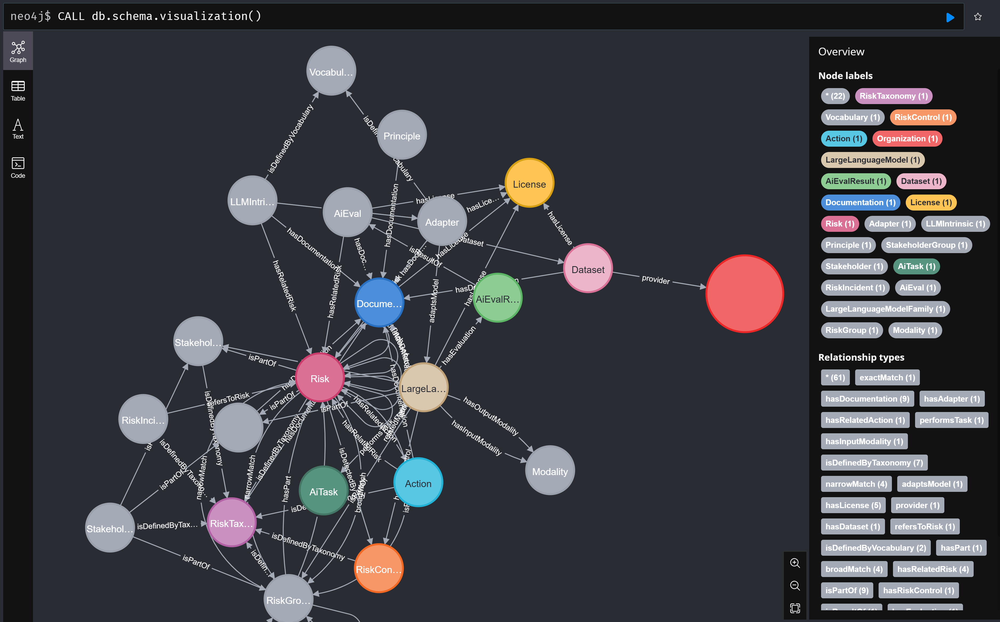

# AI-LinkMO: AI Linked Data Model Operate

${\color{green}A\ Reference\ Implementation\ of\ Operational\ AI\ Governance\ built\ on\ Open-Data}$

AI-LinkMO demonstrates operational AI governance using open data and four DevSecOps-ready patterns:

- **Command Line Interface (CLI)** - Automation and CI/CD pipeline integration (fastCLI, slowCLI modes)
- **FastAPI Backend** - REST API for system integration and GRC tools (single source of truth with caching)
- **Svelte Web UI** - User-friendly exploration for non-technical stakeholders with persistent identifiers
- **Graph Database** - Relationship analysis and regulatory crosswalks

## About Trustworthy AI

- [AI Ontology](https://ibm.github.io/ai-atlas-nexus/ontology/): System view and Risk view.
- Open Data from [AI Atlas Nexus](https://ibm.github.io/ai-atlas-nexus/)
- Open Data from [FINOS](https://air-governance-framework.finos.org/). 

## About LinkMO

LinkMO (Linked Data Model Operate) is an emerging project built on [linkml](https://linkml.io) to operationalize *Open Data* using *Open Schema* for domain-specific *XX-LinkMO* solutions.  The current focus is Cybersecurity - see [https://github.com/lmodel/](https://github.com/lmodel)).

---

## ${\color{green}INSTALL\ AI-LINKMO}$

Using a [uv environment](https://docs.astral.sh/uv/pip/environments/) on RHEL:

*Note: Tested in VSCODE on RHEL8 (Dell Precision 5690, 64G RAM, Nvidia RTX 2000 Ada 16GB GPU, [UV](https://docs.astral.sh/uv/getting-started/installation/), Dotfiles, and newer GCC). Building [ai-atlas-nexus](https://pypi.org/project/ai-atlas-nexus/) with [cuda extensions](https://developer.nvidia.com/cuda/gpus) takes ~12mins. Inference libraries not included*.

```bash
sudo yum install gcc-toolkit-12 gcc-toolkit-14 ninja-build -y    # once off if gcc <12
# export UV_DEFAULT_INDEX=https://rp.example.com/repository/pypi-all/simple

scl enable gcc-toolset-12 bash
uv cache clean
MAX_JOBS=4 UV_HTTP_TIMEOUT=60s TORCH_CUDA_ARCH_LIST="8.6" uv sync   # be patient

# If `ai-atlas-nexus` package was upgraded, rebuild UI schema:

uv run gen-json-schema --stacktrace --preserve-names --mergeimports .venv/lib/python3.14/site-packages/ai_atlas_nexus/ai_risk_ontology/schema/ai-risk-ontology.yaml > lib/frontend/static/schema/ai-risk-ontology.json
```

The offline CLI is ready. Use FastAPI for blazing CLI performance.

## ${\color{green}FastAPI}$

Start FastAPI server ([details](lib/api/README.md)):

```bash
uv run uvicorn lib.api.server:app --reload
```

Its aligned to [the Ontology](https://ibm.github.io/ai-atlas-nexus/ontology/).



## ${\color{green}WebApp}$

In 2nd terminal, start Web Application ([details](lib/frontend/README.md)):

```bash
cd lib/frontend
npm install
npm run dev
```

Frontend:



Record Viewer:



Curation Mode:



## ${\color{green}Fast CLI}$

In 3rd terminal, try CLI ([details](lib/cli/README.md)):

```bash
./ai -h
./ai risk -h
```



The CLI is aligned to [the Ontology](https://ibm.github.io/ai-atlas-nexus/ontology/) and [OpenAPI](lib/api/openapi.yaml), for consistent CLI, API, Frontend and Schema.

| Examples from [test_cli_examples](./lib/test/test_cli_examples.py) |
| :------------------------------- |
| Taxonomies |
| `./ai taxonomy --byod`  `[ --count ]` |
| `./ai taxonomy nist-ai-rmf`  `[ --count ]` |
| `./ai taxonomy --hasDocumentation NIST.AI.600-1`  `[ --count ]` |
| Risks |
| `./ai risk --byod`  `[ --count ]` |
| `./ai risk --isDefinedByTaxonomy nist-ai-rmf`  `[ --count ]` |
| `./ai risk ai-and-coffee --byod`  `[ --count ]` |
| `./ai risk --isPartOf granite-guardian-harm-group`  `[ --count ]` |
| `./ai risk --risk_type inference`  `[ --count ]` |
| `./ai risk --descriptor 'specific to generative AI'`  `[ --count ]` |
| `./ai risk --phase training-tuning`  `[ --count ]` |
| > Risks related to Risk |
| `./ai risk atlas-toxic-output --related_ids`  `[ --count ]` |
| `./ai risk atlas-toxic-output --related`  `[ --count ]` |
| `./ai risk atlas-toxic-output --related --isDefinedByTaxonomy nist-ai-rmf`  `[ --count ]` |
| Risk Groups |
| `./ai group --byod`  `[ --count ]` |
| `./ai group --type CapabilityGroup`  `[ --count ]` |
| `./ai group --isDefinedByTaxonomy ai-risk-taxonomy`  `[ --count ]` |
| `./ai group ai-risk-taxonomy-deception --byod`  `[ --count ]` |
| Obligations |
| `./ai obligation --byod`  `[ --count ]` |
| `./ai obligation --isDefinedByTaxonomy aiuc1`  `[ --count ]` |
| `./ai obligation --hasEvidenceCategory TECHNICAL_IMPLEMENTATION`  `[ --count ]` |
| `./ai obligation --hasTypicalLocation 'Engineering Practice'`  `[ --count ]` |
| `./ai obligation --hasTypicalLocation 'Engineering Tooling'`  `[ --count ]` |
| `./ai obligation aiuc1-ctrl-b002-1`  `[ --count ]` |
| Recommendations |
| `./ai recommendation --byod`  `[ --count ]` |
| `./ai recommendation --hasEvidenceCategory LEGAL_POLICIES`  `[ --count ]` |
| `./ai recommendation --hasEvidenceCategory OPERATIONAL_PRACTICES`  `[ --count ]` |
| `./ai recommendation --hasTypicalLocation 'Internal policies'`  `[ --count ]` |
| Principles |
| `./ai principle --byod`  `[ --count ]` |
| `./ai principle --isDefinedByTaxonomy aiuc1`  `[ --count ]` |
| `./ai principle --hasDocumentation AIUC-1-Jan-2026`  `[ --count ]` |
| `./ai principle principle-un-do-no-harm`  `[ --count ]` |
| AI Models |
| `./ai model --byod`  `[ --count ]` |
| `./ai model --isPartOf shieldgemma`  `[ --count ]` |
| `./ai model --hasRiskControl gg-groundedness-detection`  `[ --count ]` |
| `./ai model --isProvidedBy google`  `[ --count ]` |
| `./ai model --hasDocumentation granite-guardian-paper`  `[ --count ]` |
| `./ai model --hasLicense gemma-terms-of-use`  `[ --count ]` |
| `./ai model --performsTask code-generation`  `[ --count ]` |
| `./ai model --hasInputModality modality-text`  `[ --count ]` |
| `./ai model --hasOutputModality modality-text`  `[ --count ]` |
| AI Tasks |
| `./ai task --byod`  `[ --count ]` |
| `./ai task table-question-answering`  `[ --count ]` |
| `./ai task --isDefinedByTaxonomy hf-ml-tasks`  `[ --count ]` |
| `./ai task --isPartOf hf-ml-tasks-group-multimodal`  `[ --count ]` |
| `./ai task --requiresCapability ibm-cap-contextual-understanding`  `[ --count ]` |
| Evaluations |
| `./ai evaluation --byod`  `[ --count ]` |
| `./ai evaluation --hasDocumentation arxiv.org/2310.12941`  `[ --count ]` |
| `./ai evaluation ai_eval_PopQA`  `[ --count ]` |
| `./ai evaluation --hasDataset truthfulqa/truthful_qa`  `[ --count ]` |
| `./ai evaluation --hasTasks text-generation`  `[ --count ]` |
| `./ai evaluation --hasLicense license-cc-by-4.0`  `[ --count ]` |
| > Evaluations for Risks |
| `./ai evaluation --hasRelatedRisk atlas-hallucination`  `[ --count ]` |
| `./ai evaluation --related --hasRelatedRisk mit-ai-causal-risk-timing-post-deployment`  `[ --count ]` |
| Datasets |
| `./ai dataset --byod`  `[ --count ]` |
| `./ai dataset CybersecurityBenchmarks_datasets_frr`  `[ --count ]` |
| `./ai dataset --hasLicense license-apache-2.0`  `[ --count ]` |
| `./ai dataset --hasDocumentation repo_nyu-mll_BBQ`  `[ --count ]` |
| `./ai dataset --provider bigcode`  `[ --count ]` |
| Adapters |
| `./ai adapter --byod`  `[ --count ]` |
| `./ai adapter ibm-factuality-adapter-granite-3.2-5b-harm-correction`  `[ --count ]` |
| `./ai adapter --hasDocumentation granite-guardian-paper`  `[ --count ]` |
| `./ai adapter --hasAdapterType LORA`  `[ --count ]` |
| `./ai adapter --implementsCapability ibm-cap-contextual-understanding`  `[ --count ]` |
| `./ai adapter --adaptsModel granite-guardian-3.3-8b-instruct`  `[ --count ]` |
| `./ai adapter --hasLicense license-apache-2.0`  `[ --count ]` |
| > Adapting to Risk |
| `./ai adapter --hasRelatedRisk granite-relevance`  `[ --count ]` |
| `./ai adapter --hasRelatedRisk granite-relevance --related`  `[ --count ]` |
| LLMIntrinsics |
| `./ai intrinsic --byod`  `[ --count ]` |
| `./ai intrinsic --hasDocumentation arxiv.org/2504.11704`  `[ --count ]` |
| `./ai intrinsic ibm-factuality-intrinsic-jailbreak`  `[ --count ]` |
| `./ai intrinsic --hasAdapter ibm-factuality-adapter-granite-3.3-8b-instruct-lora-citation-generation`  `[ --count ]` |
| `./ai intrinsic --isDefinedByVocabulary ibm-factuality`  `[ --count ]` |
| > LLMIntrinsics for Risks |
| `./ai intrinsic --hasRelatedRisk nist-confabulation`  `[ --count ]` |
| `./ai intrinsic --related --hasRelatedRisk granite-answer-relevance`  `[ --count ]` |
| Actions |
| `./ai action --byod`  `[ --count ]` |
| `./ai action --isDefinedByTaxonomy nist-ai-rmf`  `[ --count ]` |
| `./ai action --byod --isDefinedByTaxonomy acme-ai-taxonomy`  `[ --count ]` |
| `./ai action acme-action-coffee-001 --byod`  `[ --count ]` |
| `./ai action --hasAiActorTask 'Human Factors'`  `[ --count ]` |
| > Actions for a Risk |
| `./ai action --hasRelatedRisk nist-human-ai-configuration`  `[ --count ]` |
| `./ai action --related_ids --hasRelatedRisk atlas-toxic-output`  `[ --count ]` |
| Controls |
| `./ai control --byod`  `[ --count ]` |
| `./ai control --isDefinedByTaxonomy shieldgemma-taxonomy`  `[ --count ]` |
| `./ai control gg-function-call-detection`  `[ --count ]` |
| > Controls for Risk |
| `./ai control --detectsRiskConcept shieldgemma-dangerous-content`  `[ --count ]` |
| `./ai control --hasRelatedRisk shieldgemma-hate-speech`  `[ --count ]` |
| `./ai control --related --hasRelatedRisk atlas-toxic-output`  `[ --count ]` |
| Incidents |
| `./ai incident --byod`  `[ --count ]` |
| `./ai incident --isDefinedByTaxonomy ibm-risk-atlas`  `[ --count ]` |
| `./ai incident ibm-risk-atlas-ri-fake-legal-cases`  `[ --count ]` |
| > Incidents for Risks |
| `./ai incident --hasRelatedRisk atlas-dangerous-use`  `[ --count ]` |
| `./ai incident --refersToRisk atlas-evasion-attack`  `[ --count ]` |
| `./ai incident --hasRelatedRisk atlas-dangerous-use --related`  `[ --count ]` |
| Documents |
| `./ai document --byod`  `[ --count ]` |
| `./ai document repo_stanford_air_bench_2024`  `[ --count ]` |
| `./ai document --hasLicense license-cc-by-4.0`  `[ --count ]` |
| BenchmarkMetaCards |
| `./ai benchmarkcard`  `[ --count ]` |
| LLM Question Policies |
| `./ai questionpolicy --byod`  `[ --count ]` |
| Stakeholders |
| `./ai stakeholder --byod`  `[ --count ]` |
| `./ai stakeholder --isDefinedByTaxonomy csiro-responsible-ai-patterns`  `[ --count ]` |
| `./ai stakeholder csiro-stakeholder-ai-technology-producers`  `[ --count ]` |
| `./ai stakeholder --isPartOf csiro-stakeholder-group-organization-level`  `[ --count ]` |
| Organizations |
| `./ai organization --byod`  `[ --count ]` |
| `./ai organization --grants_license license-cc-by-4.0`  `[ --count ]` |
| |
| Export cypher queries (Neo4J integration) |
| `./ai graph cypher --export --byod`  `[ --count ]` |
| Export full Knowledge Graph |
| `./ai graph --export --byod`  `[ --count ]` |

And so on ..

### ${\color{green}Bring\ Your\ Own\ Data}$

AI Atlas Nexus promotes a community-driven approach to curating and cataloguing resources. You can "bring
your own Data" by adding schema-compliant yaml files to [./byo/data](./byo/data) directory. See [upstream readme](https://github.com/IBM/ai-atlas-nexus/blob/main/src/ai_atlas_nexus/ai_risk_ontology/util/README.md).

This repository includes [Risk](./byo/data/acme-ai-taxonomy.yaml) and [DevSecOps](./byo/data/acme-ai-dso-taxonomy.yaml) examples. Validate the LinkML Schema as follows:

```bash
SDIR=".venv/lib/python3.11/site-packages/ai_atlas_nexus/ai_risk_ontology/"
uv run linkml validate byo/data/*.yaml  -s ${SDIR}/ai-risk-ontology.yaml 
```

### ${\color{green}Graph\ DB\ Visualization}$

Convert schema and instance data into Cypher representation to populate a Graph Database:

```bash
./ai graph cyper --export --byod
podman login dockerhub.registry.example.com
podman pull dockerhub.registry.example.com/neo4j
podman run --name ran_neo4j --rm --volume $(pwd)/graph/cypher:/examples --publish=7474:7474 --publish=7687:7687 --env NEO4J_AUTH=neo4j/demodemo  dockerhub.registry.example.com/neo4j:latest
```

Import into Neo4J:

```bash
docker exec --interactive --tty ran_neo4j cypher-shell -u neo4j -p demodemo
:source /examples/ai-risk-ontology.cypher
```

Open [Neo4J Browser](http://localhost:7474/browser/) (login neo4j/demodemo) and `CALL db.schema.visualization()`:

---



---

### ${\color{green}Crosswalk\ (Mappings)}$

Crosswalk documents are intended to provide a mapping of concepts and terms between the different taxonomies, frameworks, standards and regulation documents. The `./ai` command produces a crosswalk between the risks in two taxonomies, finds related risks, and displays a subset of risk content in a pandas dataframe.

```bash
./ai crosswalk --isDefinedByTaxonomy nist-ai-rmf --isDefinedByTaxonomy2 acme-risk-taxonomy --export [ --byod ]
```

## ${\color{green}CLI/API\ TESTING}$

Comprehensive unit tests are available for all CLI commands documented in this README.

- **101 test cases** covering all CLI examples in both API and local modes
- **Automated server management** for API mode tests
- **Parametrized tests** for efficient coverage
- **CI/CD ready** with GitHub Actions examples

```bash
# Verify test setup
uv run python lib/test/check_tests.py

# Run fast tests (API mode only, ~2 min)
,/tests.sh fast
```

See [lib/test/README.md](lib/test/README.md) for detailed testing documentation.

## AI ATLAS NEXUS LLM INFERENCING

Note: ${\color{orange}Requires\ LLM\ service!}$

The **AI Atlas Nexus** library leverages Large Language Models (LLMs) to infer risk dimensions. You need access to LLM model (i.e. ibm-granite/granite-3.1-8b-instruct) and inference engines (vLLM) is required. On hosts with [NVIDIA Container Toolkit](https://docs.nvidia.com/datacenter/cloud-native/container-toolkit/latest/install-guide.html#with-dnf-rhel-centos-fedora-amazon-linux), we can use the official [vLLM container](https://docs.vllm.ai/en/stable/deployment/docker/):

```bash
# example only
podman login dockerhub.registry.example.com
podman pull dockerhub.registry.example.com/vllm/vllm-openai

VLLM_API_KEY="${VLLM_API_KEY:-xxxxxxxxxxxxxxxxxxxxxxxxxyyyyyyyy}"
VLLM_HOST_IP="${VLLM_HOST_IP:-127.0.0.1}"
VLLM_API_URL="${VLLM_HOST_IP}/v1"
UV_TORCH_BACKEND=auto

podman run --device nvidia.com/gpu=all  -v ~/.cache/modelscope/hub/models:/root/.cache/modelscope/hub/models  -e REQUESTS_CA_BUNDLE=/cert.pem --mount type=bind,source=/etc/pki/tls/cert.pem,target=/cert.pem  --env "VLLM_USE_MODELSCOPE=True" --env "TRANSFORMERS_OFFLINE=1" --env "TORCH_CUDA_ARCH_LIST=8.6" --env "PYTORCH_CUDA_ALLOC_CONF=garbage_collection_threshold:0.6,max_split_size_mb:64,expandable_segments:True" -p 8000:8000 --ipc=host  dockerhub.registry.example.com/vllm/vllm-openai   --model facebook/opt-125m --gpu_memory_utilization="0.8"
```

## ARES Evaluation

ARES is an evaluation framework for Retrieval-Augmented Generation (RAG) systems.
An [extension for ai-atlas-nexus](https://github.com/ibm/ai-atlas-nexus-extensions/tree/main/ran-ares-integration) is available but a PR is needed for install.

## ADOPT?

Open Data / Open Source / Inner Source promotes a community driven approach to curating and cataloguing resources such as datasets, benchmarks and mitigations.

### ${\color{green}Curate\ your\ own\ Open\ Data}$

Before curating the Model, its recommended you familiarize yourself with the basics of [LinkML](https://linkml.io/linkml/intro/overview.html) and its metamodel components. Like many modeling frameworks, LinkML comes with a controlled vocabulary of terms that are used to describe the model. While the modeling language is robust and might seem overwhelming, understanding just a few basic components is helpful.

### ${\color{green}Building\ Python\ Applications}$

Refer to the [Python Reference](https://ibm.github.io/ai-atlas-nexus/reference/library_reference/).  The SchemaView class in the linkml-runtime provides a method for dynamically introspecting and manipulating schemas. This can be used to programatically explore or edit the AI Atlas Nexus. See [documentation](https://ibm.github.io/ai-atlas-nexus/examples/notebooks/schema_viewer/) and `schemaview()` function in `ai.py`.

```bash
./ai schemaview --introspect
```

## Research

- [Pathways to Open Data, Linux Foundation](https://www.linuxfoundation.org/hubfs/LF%20Research/WOIC_ChallengeSession2024_Report_032525.pdf)
