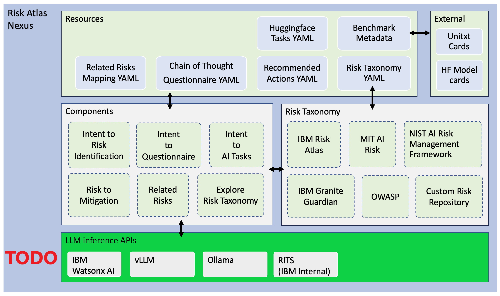

# AI-LinkMO: AI Linked Data Model Operate

> "Search out, to no one favour show; with heart that justice loves\
> Consult, then act; this is the rule that right approves."\
> — Thiruvalluvar, *Tirukkural* 541, *The Right Sceptre* (tr. G.U. Pope, 1886)

**Regulation in → auditable, queryable AI governance out.**

AI-LinkMO is a reference implementation of *operational* AI governance. It takes open AI-risk data and turns it from documents you *read* into linked data you can *query, integrate, and automate against*. The sources are the [IBM AI Atlas Nexus ontology](https://ibm.github.io/ai-atlas-nexus/ontology/), the [FINOS AI Governance Framework](https://air-governance-framework.finos.org/), NIST AI RMF, the EU AI Act, ISO/IEC 42001, the OWASP Top 10s and more: nine frameworks, each credited in [NOTICE](NOTICE). **One linked model, four ways in: a risk identifier means the same thing in a terminal, a pipeline, a browser, and a graph query.**

*Here to run it? Start at [Install](#install). Here to see what this adds to AI Atlas Nexus? Start at [Where this sits](#where-this-sits-an-execution-workshop-over-ai-atlas-nexus).*

> **Prefer to ask?** Install the docent skill into any agent you already use (`npx skills add noelmcloughlin/knowledge-trust-ladder --skill ktl-docent --yes`) and ask it about this project, such as *where the EU AI Act encoding comes from, and who checked it*. It answers from this repository's own bundle and says how far each answer has been checked. **Agents:** if `.lokf/knowledge/index.md` exists, read it first; `llms.txt` says how to weigh it.

## Why governance needs a catalogue

AI governance today mostly lives in PDFs and spreadsheets:

- **Frameworks multiply.** NIST AI RMF, EU AI Act, ISO/IEC 42001, FINOS AIGF, OWASP LLM Top 10, SR 11-7... each with its own vocabulary for overlapping risks and controls.
- **Mapping is manual.** Answering *"which of our controls satisfy both NIST and the EU AI Act?"* means analysts building crosswalk spreadsheets by hand: slow, error-prone, and stale the moment a framework updates.
- **Governance and engineering don't share a language.** Compliance teams work in policy clauses; engineers work in pipelines and APIs. Nothing traces a regulatory obligation to a deployed control.

The knowledge already exists; it is in the frameworks. What is missing is the catalogue: one model in which a risk, a control, and the clause that requires it are each one record with one identifier. Then the question above is a query rather than a quarter's work, and the answer is the same whoever asks it and however they ask.

## One model, four ways in

AI-LinkMO closes that gap with **one linked data model** (a LinkML ontology of risks, controls, obligations, taxonomies, models, evaluations, incidents...) exposed through **four DevSecOps-ready access patterns**, so every stakeholder gets the same single source of truth in the form they can use:

| Access pattern | Who it serves | What you get |
| :--- | :--- | :--- |
| **Command Line Interface (CLI)** | Engineers, CI/CD pipelines | Automation-friendly queries and exports (fastCLI/slowCLI modes) |
| **FastAPI Backend** | System integrators, GRC tools | REST API as the single source of truth, aligned to [OpenAPI](lib/api/openapi.yaml) |
| **Svelte Web UI** | Risk, compliance & business stakeholders | Point-and-click exploration with persistent identifiers, no coding required |
| **Graph Database (Neo4j)** | Analysts, data scientists | Relationship analysis and regulatory crosswalks as a queryable graph |

<p align="center">
  
</p>

Because CLI, API, frontend and schema are all generated from [the same ontology](https://ibm.github.io/ai-atlas-nexus/ontology/), a risk identifier means the same thing everywhere, and that is what makes the traceability auditable. The couplet at the top is the shape of the work: *search out* the frameworks; show *no favour* among them, one ontology and one identifier for each thing; *consult* them against each other, which is what a crosswalk is; *then act*, from a terminal, a pipeline, a browser, or a graph query.

## What it looks like

- *"Show me every risk defined by NIST AI RMF"* → `./ai risk --isDefinedByTaxonomy nist-ai-rmf`
- *"Which controls mitigate toxic output?"* → `./ai control --related --hasRelatedRisk atlas-toxic-output`
- *"Map NIST risks to the FINOS framework"* → `./ai crosswalk --isDefinedByTaxonomy nist-ai-rmf --isDefinedByTaxonomy2 finos-aigf --export --byod`
- *"Add our internal AI policy taxonomy alongside the public ones"* → drop a schema-compliant YAML file into [./byo/data](./byo/data) ([Bring your own data](#bring-your-own-data))
- *"Walk me through all four, with a real incident"* → [byo/notes/EXAMPLES.md](byo/notes/EXAMPLES.md), a scripted demo that traces a leaked-prompt incident to its risks and controls and ends in a CI gate

Screenshots of each door are in [byo/images/](byo/images/): the API starting, the web UI and its record viewer, curate mode, the CLI, a crosswalk, and the graph in Neo4j.

### Key concepts, in plain English

| Term | What it means |
| :--- | :--- |
| **Taxonomy** | A framework's catalogue of risks/controls (e.g. NIST AI RMF, FINOS AIGF) |
| **Risk** | A named, identified harm (e.g. `atlas-toxic-output`, `nist-confabulation`) |
| **Control / Action** | Something you do or deploy to detect or mitigate a risk |
| **Obligation** | A requirement a framework imposes, with evidence categories describing how you prove it |
| **Crosswalk** | A machine-generated mapping of equivalent concepts *between* frameworks |
| **Incident** | A realised risk, something that happened (e.g. `ibm-risk-atlas-ri-fake-legal-cases`), linked back to the risks it demonstrates |
| **Evaluation** | A benchmark or test that measures a risk or a capability (e.g. `ai_eval_PopQA`), linked to the datasets and tasks it uses |
| **BYOD** | Bring Your Own Data: your internal policies encoded in the same schema, queryable alongside the open data |

## Where this sits: an execution workshop over AI Atlas Nexus

AI-LinkMO's family is [IBM AI Atlas Nexus](https://ibm.github.io/ai-atlas-nexus/). Upstream provides the model and the data; this repository is a workshop that executes over them. It adds doors, encodings and checks, and no ontology of its own.

### Upstream: AI Atlas Nexus

- **The AI Risk Ontology**, a [LinkML](https://linkml.io/) schema of risks, controls, obligations, taxonomies, models, evaluations and incidents. Every CLI command, API route, UI form and graph label here is generated from it, which is why one identifier means the same thing at every door.
- **The packaged risk data**: the IBM AI Risk Atlas, the public taxonomies packaged with it, and the relationships between them. The related-risk, related-control and related-incident lookups, and so the crosswalk, walk upstream's relationships through the `ai-atlas-nexus` library; the LLM inference path calls its risk identification.
- **The toolchain**: the library that loads the ontology and the data, and LinkML's generators, which produce the JSON Schema the web UI ships.

### What this repository adds

| Added here | Where |
| :--- | :--- |
| Four doors onto one model: CLI, FastAPI, Svelte UI, Cypher export for Neo4j | `lib/cli/`, `lib/api/`, `lib/frontend/`, `graph/` |
| Nine governance frameworks encoded in the ontology's own classes, as bring-your-own-data examples | `byo/data/` |
| Crosswalks between two taxonomies, on screen and as files | `./ai crosswalk`, `graph/` |
| A scripted walk through all four doors, ending in a CI gate | `byo/notes/EXAMPLES.md` |
| Every CLI example run as a test, in API mode and in local mode | `lib/test/` |
| Curate mode: a person adds, edits or deletes records in their own files through the UI | `PUT /byo` |

### What it does not add yet

Provenance on the records.

- Each file under `byo/data/` says in a header comment which script produced it and from which input. Every row carries the same `dateCreated`, the day the generator ran.
- Nothing says who checked an encoding against the framework's own text, from which edition, or when it should be checked again. The ontology has no field for it. For an auditor that is the first question, and for all nine frameworks the answer today is *nobody has checked this yet*.
- Curate mode has the same gap: a person edits a record, but the persona is not an identity and the record keeps no trace of who.

Whether provenance belongs in the ontology or elsewhere is the second roadmap bullet under [For the curious](#for-the-curious).

The repository also keeps a small knowledge bundle about *itself* under `.lokf/`: documentation, not governance data, and no part of the product. It is described at the [end of this README](#about-this-repositorys-own-knowledge-bundle).

## Install

Python 3.11+ and [uv](https://docs.astral.sh/uv/); Node 22 for the web UI.

```bash
uv sync --extra test
./ai --help
```

That is the offline CLI, ready to use. If `uv sync` needs to compile anything on your machine (an older `gcc`, a CUDA build, a corporate package index), or you have upgraded `ai-atlas-nexus` and need to regenerate the UI's schema, see [docs/install-notes.md](docs/install-notes.md).

## Usage

### Start the API

Start the FastAPI server ([details](lib/api/README.md)):

```bash
uv run uvicorn lib.api.server:app --reload
```

It listens on port 8000 and is aligned to [the ontology](https://ibm.github.io/ai-atlas-nexus/ontology/) and to [OpenAPI](lib/api/openapi.yaml). Its write endpoints are not authenticated, so keep it on localhost; see [Status and caveats](#status-and-caveats).

### Start the web UI

In a second terminal ([details](lib/frontend/README.md)):

```bash
cd lib/frontend
npm ci
npm run dev
```

The login in the top corner is a persona picker for the demo, not authentication. **Curate mode**, which lets you add, edit and delete records in your own data files, sits behind it.

### Try the CLI

In a third terminal ([details](lib/cli/README.md)):

```bash
./ai -h
./ai risk -h
```

The CLI is aligned to the ontology and to OpenAPI, for consistent CLI, API, frontend and schema. Every entity type is one command away: [docs/cli-examples.md](docs/cli-examples.md) lists them all, and most of them are also test cases in [lib/test/test_cli_examples.py](lib/test/test_cli_examples.py).

## Working with the data

### Bring your own data

The open frameworks are the starting point. The value comes when your **internal** policies, taxonomies and controls live in the same model, so one query spans public regulation and private practice.

Bring your own data by adding schema-compliant YAML files to the [./byo/data](./byo/data) directory. See the [upstream readme](https://github.com/IBM/ai-atlas-nexus/blob/main/src/ai_atlas_nexus/ai_risk_ontology/util/README.md).

This repository includes [FINOS](./byo/data/finos-aigf.yaml) and related examples (ffiec, eu ai, iso42001, nist_sp_800_53, owasp_llm_t10, owasp_ml_t10, sr_11_7). Validate contributed files against the schema as follows:

```bash
SDIR="$(uv run python -c 'import ai_atlas_nexus, pathlib; print(pathlib.Path(ai_atlas_nexus.__file__).parent / "ai_risk_ontology" / "schema")')"
uv run linkml validate byo/data/*.yaml -s "${SDIR}/ai-risk-ontology.yaml"
```

### Graph database

Governance data is naturally a graph: risks relate to controls, controls implement obligations, obligations trace to frameworks. Convert schema and instance data into Cypher to populate a graph database:

```bash
./ai graph cypher --export --byod
```

The Cypher export is built from the packaged ontology data, so it shows the open frameworks; `--byod` does not add your uploads to it (see [Status and caveats](#status-and-caveats)).

```bash
podman pull docker.io/library/neo4j
podman run --name ran_neo4j --rm --volume $(pwd)/graph/cypher:/examples --publish=7474:7474 --publish=7687:7687 --env NEO4J_AUTH=neo4j/<choose-a-password> docker.io/library/neo4j:latest
```

Import into Neo4j:

```bash
docker exec --interactive --tty ran_neo4j cypher-shell -u neo4j -p <your-password>
:source /examples/ai-risk-ontology.cypher
```

Open the [Neo4j Browser](http://localhost:7474/browser/) (login `neo4j` / your password) and run `CALL db.schema.visualization()`.

### Crosswalk

Crosswalks are where the linked-data approach pays off for compliance teams: instead of hand-maintained mapping spreadsheets, mappings between the different taxonomies, frameworks, standards and regulation documents are computed from the data. The `./ai` command produces a crosswalk between the risks in two taxonomies, finds related risks, and displays a subset of risk content in a pandas dataframe.

```bash
./ai crosswalk --isDefinedByTaxonomy nist-ai-rmf --isDefinedByTaxonomy2 finos-aigf --export --byod
```

## For the curious

The sections above are everything you need to run it. What follows is for anyone who wants to go further.

- **Roadmap: automated policy-to-risk mapping.** [asago policy mapper](https://github.com/asago-ai/asago-policy-mapper) (part of [asago.ai](https://asago.ai/), an open-source AI safety and governance orchestrator) closes the semantic gap from the other direction: it reads unstructured corporate policy documents and extracts standardized risk identifiers, from *"the model must not provide medical advice"* to `atlas-hallucination` and `nist-ms-2.5`. Integrating it upstream of AI-LinkMO would complete the loop, **policy document → extracted risks → linked model → crosswalks, controls and evidence**: traceability from policy clause to deployed control.
- **Roadmap: provenance on governance records.** The AI Risk Ontology says what a risk, a control or an obligation *is*; it does not yet say what a provenance record looks like (who encoded a record, from which edition of a framework, who confirmed it, when to look again), nor what an AI step did at run time. [finos/fluxnova-ai#40](https://github.com/finos/fluxnova-ai/issues/40) sketches the second kind: context records for agents, models, tools and datasets, and runtime records for model invocations, tool calls and evaluation results, aligned to W3C PROV. Whether the first kind lands in the ontology, in the [OKF specification](https://github.com/GoogleCloudPlatform/knowledge-catalog/blob/main/okf/SPEC.md) (v0.2 defines `generated`, `verified`, `status` and `stale_after`, but for documents, and an *attested computation* for a tool's receipted result), or in a project such as [asago.ai](https://asago.ai/), is something to investigate, not something this README decides.
- **Curate your own open data.** Open Data / Open Source / Inner Source promotes a community-driven approach to curating and cataloguing datasets, benchmarks and mitigations. Before curating the model, familiarise yourself with the basics of [LinkML](https://linkml.io/linkml/intro/overview.html) and its metamodel: it comes with a controlled vocabulary of terms, and understanding a few basic components goes a long way.
- **Build Python applications on it.** The [Python Reference](https://ibm.github.io/ai-atlas-nexus/reference/library_reference/) and the `SchemaView` class in the linkml-runtime let you introspect and manipulate the schema programmatically ([documentation](https://ibm.github.io/ai-atlas-nexus/examples/notebooks/schema_viewer/)); `./ai schemaview --introspect` is the CLI's window onto the same thing.
- **Infer risk dimensions with an LLM, or evaluate with ARES.** Both need infrastructure you run yourself: [docs/llm-inferencing.md](docs/llm-inferencing.md).
- **Research.** [Pathways to Open Data, Linux Foundation](https://www.linuxfoundation.org/hubfs/LF%20Research/WOIC_ChallengeSession2024_Report_032525.pdf).

## Status and caveats

- **This is a demo.** The OpenAPI spec, the web UI, and the CLI are all going to be reworked; treat their shapes as illustrative, not as a contract.
- **Write endpoints are unauthenticated.** `PUT /byo` and `export=true` on `/graph` and `/crosswalk` change files under `byo/data/` and `graph/`. The OpenAPI spec declares an `X-API-Key` scheme on the upload, but the server does not enforce it. Run on localhost, or behind a reverse proxy that authenticates. [SECURITY.md](SECURITY.md) says what is planned.
- **The web UI's login is a persona picker**, not authentication, and the persona avatars are fetched from `ui-avatars.com`.
- **`--byod` does not reach the Cypher export.** `graph/cypher/export.py` reads the packaged ontology only, so the Neo4j walkthrough shows the open data, not your uploads.
- **Two encodings are thinner than their type suggests.** `byo/data/eu_ai_act.yaml` is a `RiskTaxonomy` with 308 requirement rows and no risks, so query it as `rule`, not `risk`; `ffiec_it_handbook.yaml` is a `RiskControlGroupTaxonomy` with groups and no controls. The generator named in every `byo/data` header lives outside this repository.
- **No encoding has been checked by a named person against its framework's text.** The header says which script produced it and from what; every row's `dateCreated` is the day the generator ran. The ontology has no field for a reviewer, and there has been no reviewer ([What it does not add yet](#what-it-does-not-add-yet)).
- **Nobody has confirmed a bundle concept yet.** All 39 are *Checked by automation only*; `ktl-curator` is how a person changes that, a few concepts at a sitting.
- **The bundle's `base_iri` is a placeholder.** Every concept's `id` is built on `https://github.com/noelmcloughlin/ai-linkmo/knowledge/`, an address nothing will ever answer at; moving to a namespace the project controls has waited for a decision since 2026-08-05 and rewrites every `id`.
- **`graph/` holds about 4 MB of regenerable output**, committed so the Neo4j walkthrough works without a long build; the export commands rewrite it in place.
- **Slow paths.** `--mode local` loads the ontology in-process on every call; the full local-mode test sweep takes about 25 minutes. LLM inferencing needs a vLLM host you run; ARES needs an upstream pull request.
- **No release yet.** `pyproject.toml` says 0.1.0, matching the `v0.1.0` baseline tag; nothing has been published. The version stays in `0.x`; see [Releases](#releases).

## Releases

No release has been cut yet. [`CHANGELOG.md`](CHANGELOG.md)'s `## [Unreleased]` section is written as changes happen, and [`semantic-release.yml`](.github/workflows/semantic-release.yml) does the rest: each merge to `main` computes the next version from Conventional Commits, promotes that section into a dated heading, bumps `pyproject.toml` and `uv.lock` to match, and publishes a GitHub Release from the same text. That runs behind the `release` Environment, so a person approves each one. Only `feat:`, `fix:` and `security:` cut a release; `docs:` and `chore:` merge cleanly and release nothing. Once the `KNOWLEDGE_RELEASE_ENABLED` repository variable is set, each release also carries the `.lokf/knowledge/` bundle as a tarball, when it changed since the last release that has one.

**This project stays below 1.0.0.** It is a demo and the shapes above are expected to change. The `v0.1.0` tag is a baseline rather than a release; it stops semantic-release defaulting a first release to 1.0.0. A breaking change bumps the minor version instead of the major one. Reaching 1.0.0 will be a decision, not something a commit message can trigger. [CONTRIBUTING.md](CONTRIBUTING.md#releasing-maintainers) has the detail.

## Development

See [CONTRIBUTING.md](CONTRIBUTING.md) for the dev setup and the pre-PR checklist. Three toolchains live here: Python and uv at the root, Node in `lib/frontend/`, and a second, separate uv project in `.lokf/`.

```text
ai                      the CLI entry point (runs lib/cli through uv)
lib/cli/                argparse generated from the OpenAPI spec; fastCLI (via the API) or slowCLI (offline)
lib/api/                FastAPI backend; openapi.yaml is the source of truth for every route
lib/frontend/           Svelte 5 web UI (Vite; proxies to the API on :8000)
lib/test/               pytest suite; its API-mode CLI cases are this README's examples, checked
graph/                  the exported ontology, crosswalk CSVs, and cypher/export.py for Neo4j
byo/data/               nine governance frameworks encoded for the AI Risk Ontology
byo/notes/EXAMPLES.md   a scripted walk through all four access patterns
byo/images/             screenshots and the architecture diagram
docs/                   longer material moved out of this README
.lokf/                  the sidecar: this repository's own knowledge bundle (knowledge/) and its tooling
llms.txt                tells an agent to read that bundle first
.github/workflows/      tests, lint, the knowledge-bundle gates, releases
```

The test suite runs 101 CLI cases, each in API mode and in local mode, with the API server started for you. Most of the examples in [docs/cli-examples.md](docs/cli-examples.md) are among them.

```bash
uv run pytest lib/test -m "not slow"     # what CI runs: API mode, ~2 min
uv run python lib/test/check_tests.py    # verify the test setup
./scripts/tests.sh                       # narrower helper modes: fast, full, coverage, ...
```

The web UI has its own gates (`npm run check`, `npm run lint`, `npm test` in `lib/frontend/`), and the knowledge bundle its own (`cd .lokf && just lokf-validate`). [lib/test/README.md](lib/test/README.md) has the detail, and [CONTRIBUTING.md](CONTRIBUTING.md) says what CI runs.

## Credits

- [IBM AI Atlas Nexus](https://ibm.github.io/ai-atlas-nexus/): the [AI Risk Ontology](https://ibm.github.io/ai-atlas-nexus/ontology/) and open risk data every access pattern here is generated from, and the `ai-atlas-nexus` package that loads them.
- [FINOS AI Governance Framework](https://air-governance-framework.finos.org/): the first framework encoded under `byo/data/`, and the model for the eight that followed; every framework's authors are listed in [NOTICE](NOTICE).
- [Nolan Nichols](https://lokf.nolan-nichols.com/), creator of [LOKF](https://lokf.nolan-nichols.com/specification/) (Linked Open Knowledge Format) and its [toolkit](https://github.com/nicholsn/lokf).
- The [LinkML Community](https://linkml.io/), creators of [LinkML](https://linkml.io/linkml/), the schema language that both the AI Risk Ontology and LOKF are written in.
- [knowledge-trust-ladder](https://github.com/noelmcloughlin/knowledge-trust-ladder): the librarian that maintains this repository's own bundle, and the docent in the notice at the top.
- Thiruvalluvar, whose *Tirukkural* has been read on the duties of those who govern for some two thousand years; the couplet at the top is in G.U. Pope's 1886 translation.

## About this repository's own knowledge bundle

This repository keeps a LOKF bundle of its own under `.lokf/knowledge/`: documentation about AI-LinkMO, kept the way AI-LinkMO keeps governance data, with one identifier per concept and a source beside every claim. The [knowledge-trust-ladder](https://github.com/noelmcloughlin/knowledge-trust-ladder) skills maintain it, installed at run time by a scheduled [workflow](.github/workflows/knowledge-librarian.yaml). They are never committed; `.agents/`, `.claude/` and `skills-lock.json` are git-ignored. None of this is part of the CLI, API, web UI or graph, and you need no skill to use them. It is also what the docent answers from: install `ktl-docent` and ask about this project instead of reading the whole README, as the notice at the top says. To contribute to that bundle, [CONTRIBUTING.md](CONTRIBUTING.md#agent-skills-optional---only-for-editing-this-repos-own-lokf-bundle) says which skills that takes.

## Contributing

[CONTRIBUTING.md](CONTRIBUTING.md) covers the dev setup and the pre-PR checklist; participation is covered by the [Code of Conduct](CODE_OF_CONDUCT.md), and [AI_COVENANT.md](AI_COVENANT.md) sets out how AI-assisted contributions are handled here.

## Security

Please review the repository security policy at [SECURITY.md](SECURITY.md) before running the API outside localhost, enabling the BYOD upload path, or using the agent-driven knowledge workflow or GitHub automation in this repo.

## License

Apache-2.0; see [LICENSE](LICENSE) and [NOTICE](NOTICE). AI-assisted work here follows [AI_COVENANT.md](AI_COVENANT.md).
